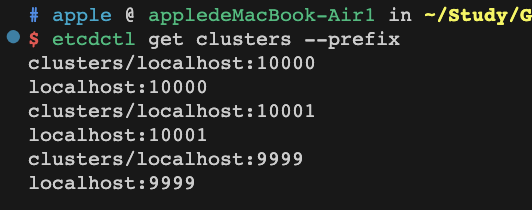

# Distributed_KV_Store

## 项目介绍

支持 HTTP、RPC 和服务注册发现的分布式 KV 缓存系统；

## 功能扩展
- 支持 RPC 
- 支持多种缓存淘汰策略（LRU、LFU、FIFO）
- 支持服务注册发现（etcd cluster）
- 支持从 etcd 获取服务节点信息
- 支持全局日志处理
- 提供了自动化测试脚本

## 功能优化方向（todo）

1. 添加缓存命中率指标（动态调整缓存容量）
2. 自动检测服务节点信息变化，动态增删节点
3. 增加更多的负载均衡策略（轮询等）
4. 增加请求限流（令牌桶算法）
5. 增加 ARC 缓存淘汰算法
...

# 项目结构
```
.
├── README.md
├── conf                            // 日志和 mysql 数据库配置
│   ├── conf.go
│   └── init.go
├── distributekv                    // 分布式键值存储系统
│   ├── byteview.go                 // 并发读写
│   ├── cache.go                    // 支持缓存淘汰策略的底层缓存
│   ├── client.go                   // gRPC 客户端实现
│   ├── consistenthash              // 一致性 hash 算法（负载均衡）
│   ├── group.go                    // 测试用的数据库和缓存数据
│   ├── groupcache.go               // 对底层缓存的封装（资源隔离、并发安全）
│   ├── peers.go                    // 服务发现
│   ├── server.go                   // gRPC 服务端实现
│   └── singleflight                // 并发请求处理优化（协程编排）
├── etcd
│   ├── cluster                     // etcd 3 节点集群
│   ├── discover.go                 // 服务发现
│   ├── getServerNodesByEtcd.go     // 从 etcd 获取服务节点信息
│   ├── getServicesAddrs.go         // 获取节点信息
│   ├── register.go                 // 服务注册（阻塞）
│   └── server_register_to_etcd     // 将服务节点信息注册到 etcd
├── go.mod
├── go.sum
├── grpc
│   ├── groupcachepb                // gRPC 
│   ├── rpcCallClient               // 简单 RPC 调用
│   ├── server                      // gRPC 服务端实现
│   └── serviceRegisterCall         // RPC 调用（以服务发现的方式）
├── main.go                                            
│── db                              // 后端数据库
│── logger                          // 全局日志
├── policy                          // 缓存淘汰策略
│   ├── fifo.go                     // FIFO 淘汰策略
│   ├── fifo_test.go
│   ├── kv.go                       // 使用策略模式
│   ├── lfu.go                      // LFU 淘汰策略（高级局部性）
│   ├── lfu_single.go
│   ├── lfu_test.go
│   ├── lru.go                      // LRU 淘汰策略（基本局部性）
│   ├── lru_test.go
│   ├── priority_queue.go           // 基于堆实现的优先队列
│   └── priority_queue_test.go
├── resources
│   └── images
├── script                          // 自动化测试脚本
│   ├── build
│   ├── run.sh
│   ├── script.md                   // 脚本使用指南
│   └── test.sh
└── utils
    └── utils.go
```


## 使用

1. 启动 etcd 集群

进入 /etcd/cluster 目录，分别运行

```bash
cd /etcd/cluster
```
```bash 
go install github.com/mattn/goreman@latest
```

```bash
goreman -f Procfile start
```


查看成员状态


2. 将三个服务节点的信息保存到 etcd 集群中

进入 server_register_to_etcd 

```bash
cd ../server_register_to_etcd
go run put1/client_put1.go && go run put2/client_put2.go && go run  put3/client_put3.go
```


查询是否成功

```bash
etcdctl get clusters --prefix
```


3. 启动自动化测试脚本

- 启动 3 个服务节点
- 发起单次 RPC 请求
- 基于服务注册发现，循环发起 RPC 请求

进入 script 目录，依次执行

```bash
cd ../../script
./run.sh

```

- 后端数据库、缓存初始数据写入成功 


- 集群节点的信息存储成功


- 超时节点将被踢出集群（keep-alive 心跳机制，可以自定义 TTL）


现在服务启动成功，我们可以运行测试脚本（开一个新的终端）：

```bash
./test.sh
```

单次 RPC 请求调用的响应：


基于服务注册发现，循环发起 RPC 请求调用结果：


## 执行日志分析

定义：

- 第一个节点（localhost:9999）；
- 第二个节点（localhost:10000）；
- 第三个节点（localhost:10001）；

### 缓存未命中


> 第一个 RPC 请求到达后，第二个节点（localhost:10000）接收到，一致性 hash 模块计算 key 的 hash 值，得到 2453906684 ，然后去哈希环上顺时针找大于等于这个 hash 值的首个虚拟节点，找到了哈希环上的第 74 个节点（对应下标 idx=73）；然后再去查虚拟节点和真实节点的映射表，发现这个虚拟节点对应的真实节点正是第二个节点（localhost:10000）；即由该节点负责处理这个 RPC 请求，因为缓存中还没有这个 key 的缓存，所以需要从数据库中查询，然后将查询结果写入缓存，并返回给客户端。（对照日志输出理解）

### 请求转发


> RPC 请求由第一个节点（localhost:9999）接收到，一致性 hash 模块计算后将 key 打到了第二个节点上（localhost:10000），第一个节点将请求转发给第二个节点处理（pick remote peer）。

查看第二个节点日志，发现它收到了来自第一个节点的转发请求。

```
3:09PM INFO <distributekv/server.go:65> Baking 🍪 : [groupcache server localhost:10000] Recv RPC Request - (scores)/(张三)
计算出 key 的 hash: 2038739146, 顺时针选择的虚拟节点下标 idx: 58, 选择的真实节点：localhost:10000，pick myself, i am localhost:10000；
3:09PM INFO <distributekv/group.go:13> Baking 🍪 : 进入 GetterFunc，数据库中查询....
3:09PM INFO <distributekv/group.go:21> Baking 🍪 : 成功从后端数据库中查询到学生 张三 的分数：100
3:09PM INFO <distributekv/cache.go:55> Baking 🍪 : cache.put(key, val)
```

日志内容很详细：收到转发的请求、根据一致性 hash 算法计算出真实节点（发现就是自己）、从后端数据库查询 'key=张三' 的值，返回 100、最终客户端收到 RPC 响应；


### 缓存命中

我们已经将 'key=张三' 的成绩存入到节点 2 的缓存中了，按照正常处理逻辑，下一次查询时应该走缓存而不是慢速数据库，我们再发起一次请求：


根据日志输出可知：一致性 hash 算法将相同的 key 打到了相同的节点上（一致性 hash 算法有效），同样的，节点 1 成功将 RPC 请求转发给了节点 2（分布式节点集群通信正常）；

最后我们还需要验证一下节点 2 的缓存是否生效：

节点 2 的日志：

```bash
3:09PM INFO <distributekv/groupcache.go:94> Baking 🍪 : cache hit...
```

客户端日志：

```bash
3:09PM INFO <rpcCallClient/client.go:47> Baking 🍪 : 成功从 RPC 返回调用结果：100
```

## 总结
- 本轮子项目参考了 geecache、groupcache、gcache 等项目，对项目中每个模块的设计和实现进行了详细分析（共 9 个部分，参见 project_analysis 部分）；
- geecache 中实现了基于 http 协议的分布式集群节点之间的通信，但并未完全实现基于 RPC 的通信，本项目参考 grpc 和 protobuf 官方文档，实现了基于 RPC 的远程过程调用，并给出了自动化测试脚本；
- 除此之外，实现了基于 etcd 集群的服务注册发现功能，服务实例在启动时将服务地址注册到 etcd，客户端根据服务名即可从 etcd 获取指定服务的 grpc 连接，然后创建 client stub 完成 RPC 调用。

## 参考资源链接
1. [Geektutu]( https://geektutu.com/post/geecache.html)                                              分布式缓存 GeeCache
2. [gcache](https://github.com/bluele/gcache)                                              缓存淘汰策略（基于策略模式）                                                                                                      
3. [groupcache](https://github.com/golang/groupcache)                                              常作为 memcached 替代
4. [grpc](https://grpc.io/docs/languages/go/quickstart/)                                              gRPC 官方文档
5. [proto3](https://protobuf.dev/programming-guides/proto3/)                                              protobuf 官方文档
6. [protobuf](https://www.notion.so/blockchainsee/Protocol-Buffer-04cba19af055479299507f04d0a24862)                                              protobuf 编码原理
7. [protoscope](https://www.notion.so/blockchainsee/protoscope-fbfe36c2eef64bfcb630be4f0bd673f5)                                              proto 个人学习笔记
8. [etcd](https://etcd.io/docs/v3.5/)                                              官方文档
9. [goreman](https://github.com/mattn/goreman)                                              etcd 集群搭建
10. [shell](https://www.shellscript.sh/)                                              shell 脚本
11. [gorm](https://gorm.io/docs/models.html)                                              快速搭建后端数据库
12. [air](https://github.com/cosmtrek/air)                                              动态加载（方便调试）
13. [log](https://github.com/charmbracelet/log)                                              极简、多彩的 Go 日志库
